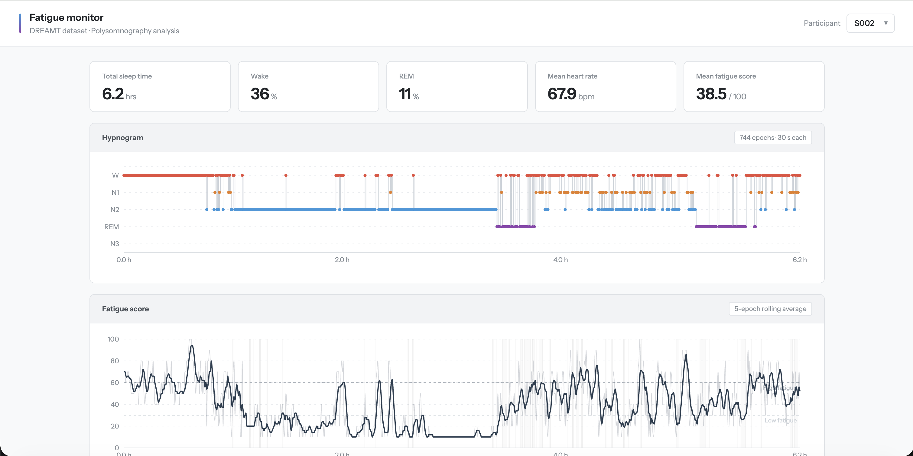
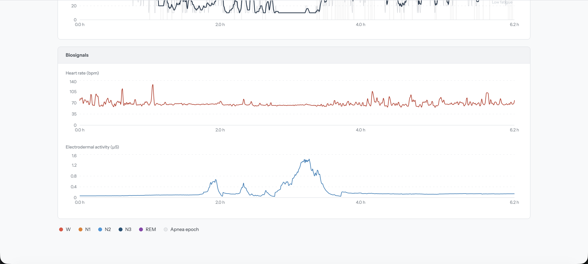

# Fatigue Monitor — DREAMT Dataset

A real-time sleep and fatigue analysis dashboard built on polysomnography data from the DREAMT dataset.

> **Data:** The participant CSV files are not included in this repo due to their size (~130 MB each). To get the data, sign up on [PhysioNet](https://physionet.org) and request access to the [DREAMT dataset](https://physionet.org/content/dreamt/2.1.0/) (DOI: 10.13026/7r9r-7r24). Once approved, download the CSV files and place them in the root directory alongside the notebook.

---

## Preview





---

## Project Layout

```
.
├── S002_whole_df.csv       ← participant data (2M+ rows each)
├── S003_whole_df.csv
├── ...
├── InitialAnalysis.ipynb   ← existing notebook
├── backend/
│   ├── main.py             ← FastAPI app
│   └── requirements.txt
├── frontend/
│   ├── public/index.html
│   └── src/
│       ├── index.js
│       ├── App.js
│       └── App.css
└── README.md
```

---

## Setup & Run

### 1 — Backend

```bash
cd backend
pip install -r requirements.txt
uvicorn main:app --reload --port 8000
```

The API will be available at `http://localhost:8000`.  
Swagger docs: `http://localhost:8000/docs`

> **First load per participant takes 5–10 seconds** (parsing ~130 MB CSV).  
> Subsequent requests for the same participant are served from in-memory cache.

### 2 — Frontend

```bash
cd frontend
npm install
npm start
```

The dashboard opens at `http://localhost:3000`.

---

## API Endpoints

| Method | Path | Description |
|--------|------|-------------|
| `GET` | `/participants` | List of participant IDs found in parent directory |
| `GET` | `/participant/{id}/epochs` | All 30-second epochs for a participant |
| `GET` | `/participant/{id}/schedule` | Recovery score and shift recommendation for a participant |

### Epoch fields

| Field | Type | Description |
|-------|------|-------------|
| `epoch_idx` | int | Sequential epoch number |
| `time_hours` | float | Start time (hours from recording start) |
| `sleep_stage` | string | W / N1 / N2 / N3 / R |
| `mean_hr` | float | Mean heart rate (bpm) |
| `hr_std` | float | HR standard deviation |
| `movement` | float | Std dev of accelerometer magnitude |
| `eda_mean` | float | Mean electrodermal activity (μS) |
| `temp_mean` | float | Mean skin temperature (°C) |
| `has_apnea` | bool | Any apnea/hypopnea event in epoch |
| `fatigue_score` | float | Heuristic fatigue score 0–100 |

### Fatigue Score Heuristic

```
base      = stage_base[sleep_stage]   # W=40, N1=25, N2=10, N3=5, R=20
hr_bonus  = 20 if hr>80 else 10 if hr≥65 else 0
std_bonus = 20 if std>3 else 10 if std≥1 else 0
mov_bonus = 20 if mov>2 else 10 if mov≥1 else 0
score     = clamp(base + hr_bonus + std_bonus + mov_bonus, 0, 100)
```

---

## Dashboard Panels

1. **Summary Cards** — Total Sleep Time · Wake % · REM % · Avg HR · Avg Fatigue Score · Recovery Score
2. **Hypnogram** — Step chart of sleep stages across the night, color-coded per stage
3. **Fatigue Score** — Raw score (faint) + 5-epoch rolling average (bold); apnea epochs shaded; reference lines at 30 (low) and 60 (high)
4. **Biosignals** — HR over time (red) and EDA over time (blue)
5. **Shift Recommendation** — Duty category, max shift length, and critical duty eligibility derived from the recovery score; a 24-hour alertness bar chart with the recommended shift window highlighted; a plain-text scheduling recommendation

### Recovery Score & Scheduling

The `/schedule` endpoint computes a **Recovery Score (0–100)** from the night's epoch data:

```
avg_sleep_fatigue = mean fatigue_score of non-wake epochs
wake_penalty      = min(wake_pct × 2, 100)
rem_penalty       = min(max(0, 20 − rem_pct) × 5, 100)
weighted_penalty  = 0.40 × avg_sleep_fatigue + 0.35 × wake_penalty + 0.25 × rem_penalty
recovery_score    = 100 − weighted_penalty
```

| Recovery Score | Duty Category | Max Shift | Critical Duty |
|---------------|---------------|-----------|---------------|
| ≥ 70 | Full Duty | 8 h | Yes |
| ≥ 40 | Reduced Duty | 6 h | No |
| < 40 | Rest Recommended | 4 h | No |

Circadian alertness per hour (Borbély two-process model, ~7 am wake time) is scaled by `recovery_score / 100` and the best consecutive shift window is selected from that curve, avoiding overnight starts (00:00–05:00).

---

## Tech Stack

| Layer | Technology |
|-------|-----------|
| Backend | Python 3.10+, FastAPI, Pandas, NumPy |
| Frontend | React 18, Recharts, Axios |
